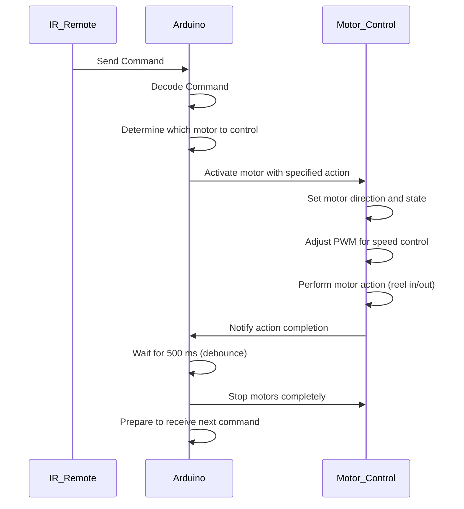

# IR Motor Control
This Arduino program can be used for controlling two DC motors (or winches) via an IR signal. The motors can be controlled to wind in both directions and at two speed settings.

## Getting Started
### Components used
- Arduino Uno R4 Minima
- Two 5-12V DC Motors
- L293D Motor Shield
- IR Receiver and Remote
- 12V/2A Power Supply
- Jumper Wires

### Wiring diagram


### Running the program
1. Connect the hardware following the circuit diagram shown above
2. Clone this repository:
    ```bash
    git clone https://github.com/paulpleela/ir-motor-control.git
    ```
3. Set up the Arduino IDE:
    - Open the Arduino IDE and connect the Arduino board to your computer using a USB cable
    - Select the correct board (`Tools > Board > Arduino AVR Boards > Arduino Uno`) and port (`Tools > Port > COMx`)
4. Install the required libraries
    - Go to `Sketch > Include Library > Manage Libraries`
    - Search and install the [IRremote library](https://github.com/Arduino-IRremote/Arduino-IRremote) (version 4.4.1)
6. Press the `->` icon in the top left of the IDE to upload the code to the Arduino board

### Controlling the motors


The motors can be controlled using the remote control buttons as shown in the image above. Pressing buttons A-H will cause the winch motor to reel its cable in or out for a short duration before stopping.

## UML Sequence Diagram



## Acknowledgements
- Part of this code was taken and modified from the Test Code provided in the [Duinotech L203D Motor Control Shield XC4472 Datasheet](https://www.electusdistribution.com.au/dbdocument/701175/xc4472_manual_14833.pdf)
- Learned from examples provided at the [ENGG1100 Arduino Demo](https://github.com/aburo8/engg1100-demo)
